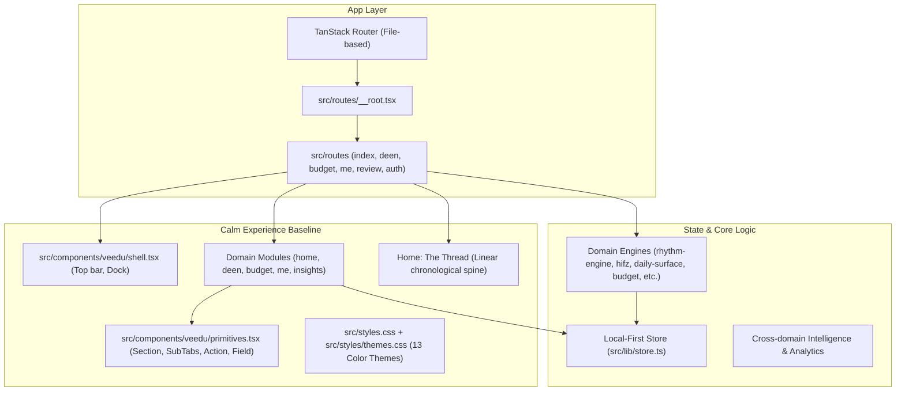

# Phase 5 — Wave 0: Firdaus Experience Architecture
## Engineering Reconnaissance & Repository Technical Comparison

**Date:** 2026-08-16  
**Investigator:** Antigravity AI Engineering  
**Subject:** Deep technical comparison of **Main Firdaus** (`veedu-home-soul`) and **Vibrant Firdaus** (`vibrant-theme-unification`)

---

## Executive Summary

Firdaus is evolving toward a **multi-experience architecture**: a single, unified product core (routes, domain intelligence, local-first store, privacy model) powering multiple distinct visual and interaction experiences:
- **Calm** (Default): Handcrafted paper-and-ink materiality, editorial serif typography, quiet accents, and the linear chronological "Thread".
- **Vibrant** (Alternative): Expressive aurora gradients, geometric display typography, life-area tonal color voices, immersive `PageHero` banners, and the modular "Bento Grid".
- **Future Experiences**: Extensible foundation for future design archetypes (e.g. Minimalist, Focus, Terminal).

The donor repository (`vibrant-theme-unification`) was generated via Lovable. Our investigation reveals that Lovable achieved the Vibrant look by **overwriting and clobbering** the Calm baseline (modifying `veedu` theme tokens, replacing Google Fonts in `__root.tsx`, replacing the Thread on Home with Bento, and altering shared primitives).

This reconnaissance establishes the exact technical blueprint to cleanly decouple **Experience Archetype** (Calm vs. Vibrant) from **Color Theme** (Veedu, Noir, Editorial, Terracotta, etc.) and integrate Vibrant without regressing production functionality.

---

## 1. Main Firdaus Architecture Baseline



### Key Technical Attributes of Main Firdaus
1. **Routing & Framework**: Vite + React 19 + TanStack Router (file-based routes in [`src/routes/`](file:///home/shahid/firdous/veedu-home-soul/src/routes)).
2. **Design Language (Calm)**:
   - **Typography**: Display: *Fraunces* (warm editorial serif), Sans: *Inter Tight*.
   - **Visual Philosophy**: "Handcrafted daily companion" with warm paper ground, ink typography, and subtle border dividers (`border-border/70`).
   - **Home Paradigm**: "The Thread" (`thread`, `thread-node`, `thread-lead`) — a hairline vertical spine that chronologically carries the day's prayers, reminders, meals, and tasks.
   - **Spaces Paradigm**: Clean, typography-driven headers with inline metadata and `SubTabs`.
3. **Theming Engine**:
   - Palette switching across 13 curated themes (`veedu`, `noir`, `editorial`, `meridian`, `obsidian`, `helix`, `lumen`, `contrast`, `command`, `terracotta`, `vermillion`, `archive`, `blanc`) via `data-theme` attribute on `<html>` and `.dark` class.
   - Tokens defined in [`src/styles/themes.css`](file:///home/shahid/firdous/veedu-home-soul/src/styles/themes.css) and registered in [`src/lib/themes.ts`](file:///home/shahid/firdous/veedu-home-soul/src/lib/themes.ts).
4. **Data & Intelligence**:
   - Zero-server local-first model via `useStore` in [`src/lib/store.ts`](file:///home/shahid/firdous/veedu-home-soul/src/lib/store.ts).
   - Domain calculation engines: [`rhythm-engine.ts`](file:///home/shahid/firdous/veedu-home-soul/src/lib/rhythm-engine.ts), [`hifz-scheduler.ts`](file:///home/shahid/firdous/veedu-home-soul/src/lib/hifz-scheduler.ts), [`daily-surface.ts`](file:///home/shahid/firdous/veedu-home-soul/src/lib/daily-surface.ts), [`budget-intelligence.ts`](file:///home/shahid/firdous/veedu-home-soul/src/lib/budget-intelligence.ts), etc.

---

## 2. Vibrant Repository Anatomy & Contents

The Vibrant repository (`/home/shahid/firdous/vibrant-theme-unification`) contains:

| Category | Files / Artifacts | Content Description |
| :--- | :--- | :--- |
| **New Components** | [`bento.tsx`](file:///home/shahid/firdous/vibrant-theme-unification/src/components/veedu/bento.tsx)<br>[`page-hero.tsx`](file:///home/shahid/firdous/vibrant-theme-unification/src/components/veedu/page-hero.tsx) | `Tile`, `IconChip`, `StatTile`, `RowTile`, `ProgressRing`, `BentoHeading`, `PageHero`, `HeroFigure`, `HeroPill`. |
| **Expanded Styles** | [`styles.css`](file:///home/shahid/firdous/vibrant-theme-unification/src/styles.css) (1,418 lines vs 432 lines)<br>[`themes.css`](file:///home/shahid/firdous/vibrant-theme-unification/src/styles/themes.css) | 40+ new CSS utilities: `panel`, `panel-lift`, `btn-solid`, `btn-quiet`, `tab-rail`, `tab-pill`, `control`, `empty-field`, `nav-dock`, `nav-item`, `app-bar`, `sheet-field`, `hero-aurora`, `orb`, `motif`, `rhythm-node`, `action-pill`. |
| **Color System** | [`themes.css`](file:///home/shahid/firdous/vibrant-theme-unification/src/styles/themes.css) | Added "Dawn Bloom" palette override and 8 category voices (`--cat-prayer`, `--cat-task`, `--cat-meal`, `--cat-kids`, `--cat-grocery`, `--cat-habit`, `--cat-money`, `--cat-self`). |
| **Modified Routes** | `index.tsx`, `deen.tsx`, `budget.tsx`, `me.tsx`, `review.tsx`, `auth.tsx`, `__root.tsx` | Integrated `PageHero` headers on all primary spaces, replaced `Thread` with `Bento` on Home, replaced Google Fonts with Sora + Manrope. |
| **Modified Primitives** | `primitives.tsx`, `shell.tsx` | Converted `Section`, `SubTabs`, `EmptyState`, `Action`, `Field`, `Meter`, `Sheet` to use Vibrant CSS utility classes. Added Lucide icons to navigation dock. |

---

## 3. Detailed Technical Breakdown (Points 3 – 8)

### 3. Purely Visual Elements
- **Color Variables**: Apricot/peach background tones, teal accents, and 8 life-area category tokens (`--cat-*`).
- **Gradients & Keyframe Animations**: Radial gradient meshes (`hero-aurora`), blur orbs (`@utility orb`), floating movement (`@utility drift`, `@utility float-soft`), and pulse effects (`@utility breathe`).
- **Surface Elevation**: Layered shadows (`--shadow-lift`, `--shadow-float`), backdrop filters (`nav-dock`, `app-bar`), and card borders (`color-mix(in oklab, var(--space-accent) 14%, transparent)`).
- **Typography Fonts**: Font family references to *Sora* (display) and *Manrope* (sans).
- **Progress Arc**: SVG `circle` stroke-dasharray animation in `ProgressRing` and `HeroRing`.

### 4. Structural Elements
- **`PageHero` Component** ([`page-hero.tsx`](file:///home/shahid/firdous/vibrant-theme-unification/src/components/veedu/page-hero.tsx)): Adds an emotional visual anchor above content across Deen, Budget, Me, and Review, containing live status badges, eyebrow, dynamic title, and figure metric.
- **Bento Tile System** ([`bento.tsx`](file:///home/shahid/firdous/vibrant-theme-unification/src/components/veedu/bento.tsx)): Multi-column grid container holding structured `Tile`, `StatTile`, and `RowTile` blocks.
- **Home Layout Shift** ([`index.tsx`](file:///home/shahid/firdous/vibrant-theme-unification/src/routes/index.tsx)): Replaces the vertical linear timeline spine with:
  1. Aurora Greeting Header + Circular `HeroRing`
  2. Horizontal `PrayerRhythm` node strip
  3. 4-item `QuickAction` pill row
  4. 2-column Bento Grid of categorized `ThreadCard` tiles
- **Navigation Dock & Bar** ([`shell.tsx`](file:///home/shahid/firdous/vibrant-theme-unification/src/components/veedu/shell.tsx)): Transformed from plain pill border into a floating frosted glass `nav-dock` with Lucide icons (`Home`, `Moon`, `Wallet`, `Flower2`).

### 5. Functional Duplications
In several route files, Vibrant re-computes or derives domain values inline rather than using shared hooks or selectors:
- **`routes/deen.tsx`**: Computes prayer countdown, prayers prayed today, and Hijri date string locally for `PageHero` pills, duplicating work from `components/deen/modules.tsx`.
- **`routes/budget.tsx`**: Inline reduces month spend, today's spend, and limit caps to feed `PageHero`.
- **`routes/me.tsx`**: Inline reads `health` and `habits` state to generate hero pills.
- **`routes/review.tsx`**: Formats weekly prayer percentage and spending totals inline.

### 6. Highly Reusable Parts
- [`src/components/veedu/bento.tsx`](file:///home/shahid/firdous/vibrant-theme-unification/src/components/veedu/bento.tsx): Standalone presentational component library.
- [`src/components/veedu/page-hero.tsx`](file:///home/shahid/firdous/vibrant-theme-unification/src/components/veedu/page-hero.tsx): Flexible banner component that accepts arbitrary props.
- Category Voices token system (`--cat-prayer`, `--cat-task`, etc.) and CSS utility classes (`panel`, `btn-solid`, `btn-quiet`, `control`, `empty-field`, `meter-track`, `meter-fill`, `sheet-field`).
- Lucide navigation icon assets.

### 7. Parts to Discard
- **Destructive Theme Override**: Overwrite of `:root:not([data-theme]), [data-theme="veedu"]` in [`themes.css`](file:///home/shahid/firdous/vibrant-theme-unification/src/styles/themes.css) (must be extracted into a dedicated `[data-experience="vibrant"]` or `[data-theme="bloom"]` block).
- **Google Fonts Overwrite**: Replacement of font stylesheet in [`__root.tsx`](file:///home/shahid/firdous/vibrant-theme-unification/src/routes/__root.tsx) (must load all font families simultaneously: *Fraunces*, *Inter Tight*, *Sora*, *Manrope*, and Arabic fonts).
- **Regressed Business Logic**: Older/simplified implementations in [`src/lib/rhythm-engine.ts`](file:///home/shahid/firdous/vibrant-theme-unification/src/lib/rhythm-engine.ts), [`src/lib/hifz-scheduler.ts`](file:///home/shahid/firdous/vibrant-theme-unification/src/lib/hifz-scheduler.ts), and [`src/lib/daily-surface.ts`](file:///home/shahid/firdous/vibrant-theme-unification/src/lib/daily-surface.ts).
- **Hardcoded Component Mutators**: Unconditional replacement of Calm classes in [`src/components/veedu/primitives.tsx`](file:///home/shahid/firdous/vibrant-theme-unification/src/components/veedu/primitives.tsx).

---

## 8. Architectural Conflicts

```
┌─────────────────────────────────────────────────────────────────────────┐
│                           THE DUALITY PROBLEM                           │
├────────────────────────────────────┬────────────────────────────────────┤
│         CALM EXPERIENCE            │        VIBRANT EXPERIENCE          │
├────────────────────────────────────┼────────────────────────────────────┤
│ • Display: Fraunces (Serif)        │ • Display: Sora (Geometric Sans)   │
│ • Sans: Inter Tight                │ • Sans: Manrope                    │
│ • Layout: Chronological Thread     │ • Layout: Modular Bento Grid       │
│ • Headers: Minimal typography      │ • Headers: Aurora PageHero + Orbs  │
│ • Accents: Single quiet accent     │ • Accents: 8 Life-Area Tonal Voices│
│ • Surfaces: Clean borders/paper    │ • Surfaces: Glowing tint & frosted │
└────────────────────────────────────┴────────────────────────────────────┘
```

1. **Theme vs. Experience Orthogonality**:
   - In Main Firdaus, "Theme" = Color Palette (Veedu, Noir, Editorial, Obsidian, etc.).
   - Vibrant is **not** just a color palette; it is a structural layout and interaction style.
   - If Vibrant is treated as a color theme, users cannot have "Noir in Bento" or "Veedu Paper in Bento".
2. **Typography Conflict**:
   - Calm needs `--font-display: "Fraunces"` and `--font-sans: "Inter Tight"`.
   - Vibrant needs `--font-display: "Sora"` and `--font-sans: "Manrope"`.
   - The system must dynamically bind font families based on the active experience mode.
3. **Primitive Component Coupling**:
   - Primitives like `Section`, `Sheet`, `Action`, `Field`, and `SubTabs` need to render appropriately under both Calm and Vibrant without code duplication.

---

## 9. Integration Risk Analysis

| Risk Area | Severity | Impact | Mitigation Strategy |
| :--- | :---: | :--- | :--- |
| **Calm Regression** | High | Calm layout looks distorted or broken if CSS utilities are globally overwritten. | Scope Vibrant utilities and theme tokens under `[data-experience="vibrant"]` or experience-specific classes. Keep Calm CSS clean. |
| **Business Logic Drift** | High | Merging donor code could overwrite recent Phase 4 intelligence algorithms. | Retain Main Firdaus as 100% source of truth for all `src/lib/*` and domain calculations. |
| **Font Flash / Layout Shift** | Medium | Loading 4+ font families may cause FOUT/CLS. | Unified Google Fonts `<link>` in `__root.tsx` with `display=swap` and fallback stacks. |
| **Mobile Performance** | Medium | Heavy backdrop filters and animated blur orbs could lag on low-power devices. | Use `contain: paint`, optimize CSS animations with `will-change: transform`, reduce blur radiuses. |
| **Lovable History Sync** | Low | Modifying git commit history or diverging repository configuration could disrupt Lovable sync. | Maintain clean branch commits without force pushes, following `AGENTS.md`. |

---

## 10. Experience System Architecture Blueprint

To achieve **"One Firdaus product with a shared product core and multiple visual experiences"**, the following architectural design is proposed:

### A. Experience State & DOM Contract
```typescript
// src/lib/experiences.ts
export type ExperienceId = "calm" | "vibrant";

export interface ExperienceDefinition {
  id: ExperienceId;
  name: string;
  tagline: string;
  description: string;
  defaultTheme: ThemeId;
}

export const experiences: ExperienceDefinition[] = [
  {
    id: "calm",
    name: "Calm",
    tagline: "The Sunnah Thread",
    description: "Quiet paper materiality, editorial serif typography, and a linear chronological thread.",
    defaultTheme: "veedu",
  },
  {
    id: "vibrant",
    name: "Vibrant",
    tagline: "Dawn Bloom",
    description: "Expressive auroras, modern geometric typography, life-area tonal voices, and modular bento tiles.",
    defaultTheme: "bloom", // or veedu with vibrant tokens
  },
];
```

DOM root structure:
```html
<html data-experience="calm" data-theme="veedu" class="light">
  <!-- or -->
<html data-experience="vibrant" data-theme="bloom" class="light">
```

### B. Dynamic Font Resolution in CSS
```css
/* src/styles.css */
:root,
[data-experience="calm"] {
  --font-display: "Fraunces", ui-serif, Georgia, serif;
  --font-sans: "Inter Tight", ui-sans-serif, system-ui, sans-serif;
}

[data-experience="vibrant"] {
  --font-display: "Sora", ui-sans-serif, system-ui, sans-serif;
  --font-sans: "Manrope", ui-sans-serif, system-ui, sans-serif;
}
```

### C. Experience-Aware Home Page Pattern (`src/routes/index.tsx`)
```tsx
export function HomePage() {
  const { experience } = useExperience(); // 'calm' | 'vibrant'
  const data = useDailyThreadData();      // Shared engine data

  return (
    <Shell space="home">
      {experience === "vibrant" ? (
        <VibrantHomePresenter data={data} />
      ) : (
        <CalmHomePresenter data={data} />
      )}
    </Shell>
  );
}
```

### D. Experience-Aware Space Headers (`PageHero` Strategy)
- In **Vibrant Experience**: `PageHero` renders prominently at the top of `/deen`, `/budget`, `/me`, `/review`.
- In **Calm Experience**: Clean typographic `<header>` renders in-flow with understated subheaders.
- Both consume the exact same underlying derived domain metrics.

---

## Conclusion & Recommended Next Wave

This reconnaissance confirms that the Vibrant repository contains a **high-quality, complete design system pass**, but it was applied destructively to the donor repo. 

By implementing an **Experience Layer** (separating Experience from Theme), Firdaus can cleanly host both Calm and Vibrant side-by-side, sharing 100% of product logic, while offering users a seamless switch between experiences.
